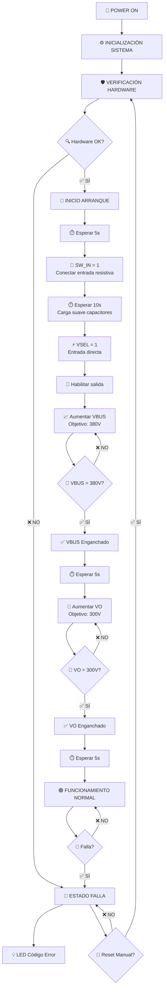
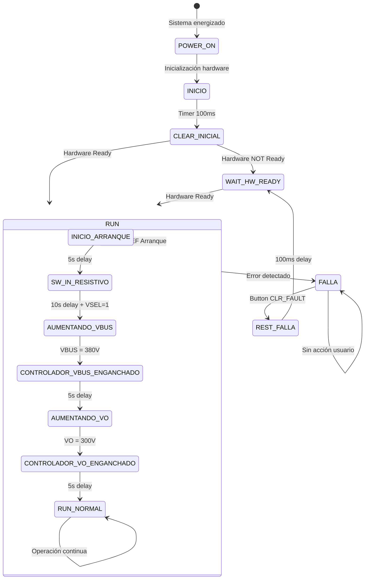

# 🔄 Diagrama de Flujo - Arranque del Convertidor qZSI

## 📊 Flujo Principal de Arranque



## 🏗️ Diagrama Detallado de Estados



## ⚙️ Secuencia de Señales de Control

```mermaid
gantt
    title Secuencia Temporal de Arranque qZSI
    dateFormat X
    axisFormat %s
    
    section Hardware Init
    Reset Drivers    :done, reset, 0, 100ms
    Enable Level Shifters :done, enable, 0, 100ms
    
    section Arranque Suave
    SW_IN = 0 (Resistivo)  :active, sw0, 0, 5000ms
    SW_IN = 1 (Directo)    :sw1, after sw0, 10000ms
    VSEL = 1 (Bypass)      :vsel, 5000ms, 10000ms
    
    section Control VBUS
    Habilitar Salida       :vo_enable, 15000ms, 100ms
    Rampa VBUS 0→380V      :vbus_ramp, after vo_enable, 3000ms
    VBUS Estabilizado      :vbus_stable, after vbus_ramp, 5000ms
    
    section Control VO
    Clear Vo Inicial       :vo_clear, after vbus_stable, 100ms
    Rampa VO 0→300V        :vo_ramp, after vo_clear, 2000ms
    VO Estabilizado        :vo_stable, after vo_ramp, 5000ms
    
    section Operación
    Funcionamiento Normal  :normal, after vo_stable, 10000ms
```

## 📋 Descripción de Cada Etapa

### 🔧 **1. INICIALIZACIÓN (0-100ms)**
- Reset de drivers de compuerta
- Habilitación de level shifters
- Configuración inicial de periféricos
- Verificación de protecciones hardware

### 🔌 **2. ENTRADA RESISTIVA (5s)**
- `SW_IN = 0`: Conexión a través de resistor limitador
- Carga controlada de capacitores de entrada
- Protección contra corrientes de irrupción

### ⚡ **3. ENTRADA DIRECTA (10s)**
- `SW_IN = 1`: Bypass del resistor limitador
- `VSEL = 1`: Conexión directa a fuente
- Estabilización de tensión de entrada

### 🔋 **4. CONTROL VBUS (Variable)**
- Habilitación de salida PWM
- Rampa gradual de VBUS: 0V → 380V
- Control de lazo abierto inicial
- Verificación de alcance de referencia

### 🌊 **5. CONTROL VO (Variable)**
- Liberación de restricción de Vo inicial
- Rampa gradual de VO: 0V → 300V
- Transición a control normal
- Verificación de alcance de referencia

### 🟢 **6. FUNCIONAMIENTO NORMAL**
- Control automático de VBUS y VO
- Monitoreo continuo de protecciones
- Operación estable del inversor

## 🛡️ Protecciones Durante el Arranque

### Hardware
- Trip Zone activo en todo momento
- Monitoreo de sobrecorriente instantáneo
- Protección térmica de drivers

### Software
- Verificación de límites de tensión/corriente
- Timeouts en cada etapa
- Recuperación automática ante fallas menores

## ⏱️ Tiempos Típicos de Arranque

| Etapa | Tiempo | Descripción |
|-------|--------|-------------|
| Inicialización | 100ms | Setup hardware |
| Entrada Resistiva | 5s | Carga suave |
| Entrada Directa | 10s | Estabilización |
| Rampa VBUS | 2-5s | Dependiente de carga |
| Rampa VO | 1-3s | Control progresivo |
| **TOTAL** | **~20s** | Arranque completo |

Este arranque gradual asegura que no haya transitorios bruscos que puedan dañar los componentes del sistema. 🚀